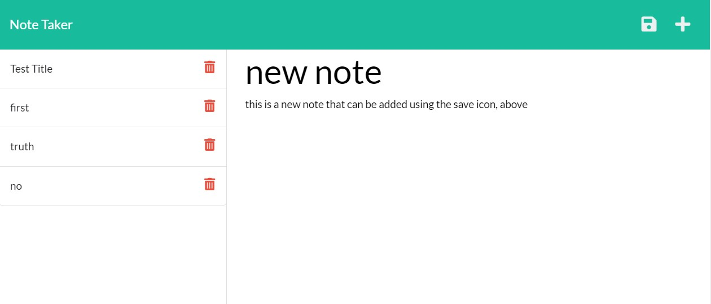

# Note Taker 

## Description

This note-taking application is an task-management tool that enables a user to write and save notes. 

You may view the deployed application [clicking this link](https://tresha-gaye.github.io/note-taker/).

**Technologies** 

The application was created by Node JS and the following NPM packages: `Express` and `Uniqid`. The application uses a db.json file on the back end that stores and retrieves notes using the `fs` module.

**Criteria and Accomplishment**

- When the user goes to the Note Taker app, and clicks on the Notes page, s/he will see existing notes on the left-hand column and can enter a new note title and text using the field on the right-hand column. 
- When the user enters a new note, a `Save` icon (the 'disc' image) appears in the navigation at the top of the page, which saves the newly entered note when it is clicked. The new note is then added to the list of existing notes on the left. 
- When the user clicks on an existing note in the list in the left-hand column, that note appears in the right-hand column
- When the user clicks on the `Write` icon (the '+' symbol) icon in the navigation at the top of the page, then the empty fields reappear and the user can enter a new note title and note text in the right-hand column.

**Below are a screenshots of the app showing the functionality:**

  

**Challenges**

The most challenging aspect of the application was the delete feature using the app.delete route. While the notes were successfully deleted from the db.json file, the functionality did not extend to the front-end. T results was that deleted notes persisted on the front end until the server was restarted and the browser refreshed. This will be improved upon in version 1.1 so that the user will be able to delete saved notes and have the browser refresh immediately without the deleted.

## Contributing

## Credits

**The following resources were used to complete this project:**
1. UCONN Coding Bootcamp's modules on Express.js and Node JS
2. [NodeJs](https://nodejs.org/api/modules.html) Documentation 
3. [Express](https://www.npmjs.com/package/express) Documentation 
4. [Uniqid](https://www.npmjs.com/package/uniqid) Documentation

## License

